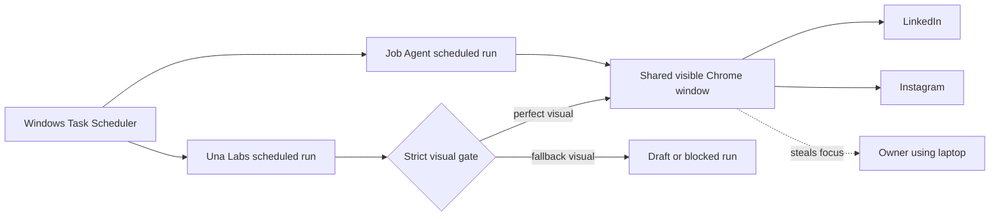
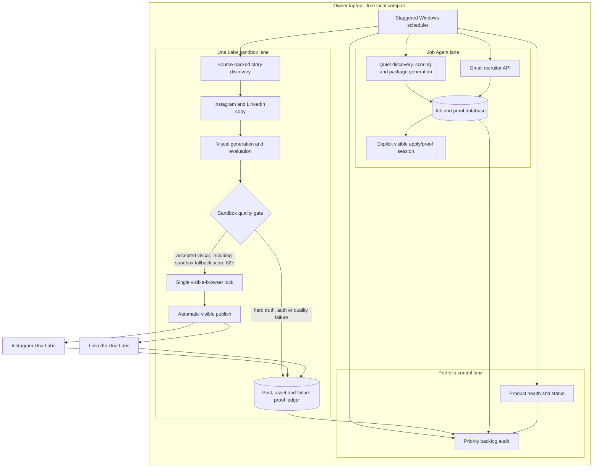
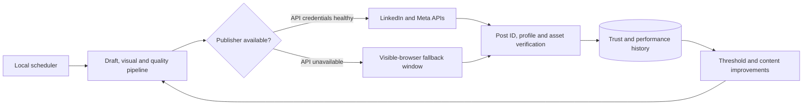
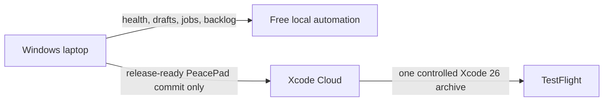

# FTC Portfolio Automation System Map

This map separates the system that existed before the July 21, 2026 audit, the
current operating model, and the API-first target. Una Labs is intentionally the
automated social-publishing sandbox. Personal accounts are outside the sandbox.

## Before the audit

Main problems:

- job and social tasks could converge on the same visible browser;
- Windows keyboard/mouse automation could interrupt normal laptop use;
- accepted fallback visuals still stopped the entire social run;
- a stopped run created work but did not create a live learning signal;
- cloud schedules and app builds were not consistently cost-scoped.

## Current system

Current trust rules:

- Una Labs publishes automatically after the sandbox gate; no owner draft
  approval is required.
- Accepted deterministic fallback visuals scoring at least 82 may publish, but
  the fallback is recorded as a warning for later performance comparison.
- Missing or stale sources, placeholder copy, rejected/low-score visuals,
  missing captions, authentication failures, and missing proof still stop the
  run.
- Visible browser access is serialized so two social runs cannot control Chrome
  simultaneously.
- Job scoring and packaging stay in the background. Live job application and
  proof actions remain explicit because LinkedIn does not offer a general
  job-seeker apply API.

## API-first target

Promotion to a personal account should require an evidence window, for example:

- at least 30 consecutive scheduled runs;
- no duplicate posts;
- no post without its intended caption or media;
- at least 95 percent verified publication success;
- clear failure records for every unsuccessful attempt;
- explicit review of the lowest-performing fallback visuals.

## Cloud boundary

Xcode Cloud is not a general portfolio scheduler. It is reserved for the
Mac-exclusive PeacePad compile, archive, and TestFlight release path.
