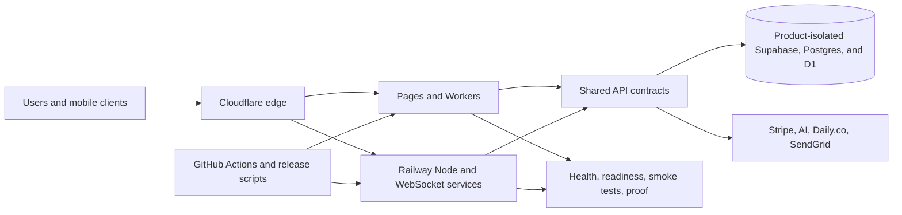

# FTC Architecture Baseline

## Objective

Improve security, performance, reliability, and cost control without adding a paid platform. This baseline standardizes the services FTC already operates; it does not merge product data or force every workload onto one runtime.

## Target model

## Placement rules

- Use Cloudflare Pages for static output and Workers for short-lived edge requests.
- Keep Railway for persistent Node processes, WebSockets, and workloads that cannot safely use the edge runtime.
- Share validation, logging, headers, error envelopes, and deployment checks; keep credentials and product data isolated.
- Do not introduce a new gateway or monitoring subscription. Use Cloudflare routing, provider logs, structured application logs, and scheduled GitHub smoke tests.

## Minimum public-service contract

Every public API should provide:

- `/health` or `/api/health` for liveness, returning service and deployment identity without secrets.
- `/readyz` where readiness differs from process liveness.
- `Cache-Control: no-store` on health responses.
- `X-Request-Id` propagation or generation and structured error correlation.
- HSTS in production, content-type protection, frame protection, a conservative referrer policy, and an explicit permissions policy.
- Sanitized production errors and a consistent `{ success, error, requestId }` envelope.

## Cost controls

- Treat `APPS/dispatch` as the only Dispatch source of truth. The stale nested Railway manifest under `APPS/saywetin/APPS/dispatch` was removed after verifying that the canonical tree contained the complete application and monorepo-safe start command. The architecture audit now rejects any recreated nested deployment tree.
- Cache immutable assets for one year and use explicit short TTLs only for safe public responses.
- Run non-urgent jobs on schedules rather than permanent processes.
- Remove inactive preview deployments only after ownership and rollback evidence are recorded.
- Review provider usage monthly before changing plans; optimize requests and runtime placement first.

## Rollout

1. Baseline: service catalog, automated audit, Dispatch headers/request IDs/readiness, and CI validation.
2. Extend the same response contract to SayWetin, then PeacePad through focused regression tests.
3. Add product-specific cache budgets, database query evidence, and scheduled smoke checks.
4. Retire additional duplicate deployment paths only after the same file, history, ownership, and rollback checks used for Dispatch.

Production deployment remains a separate, evidence-backed action. Passing repository checks does not prove that the live services have adopted the baseline.
